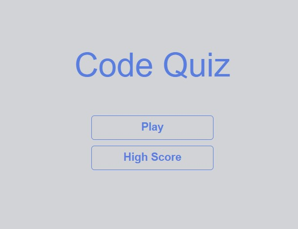

# Code-Quiz

## Description

This is a this is a JavaScript quiz website. 

## Installation

N/A

## Usage

In this website you will have a chance to test your JavaScript skills. Click the Play button to start.  The quiz generates 10 different questions, and you have to choose between 4 options for each question. You have 30 seconds to answer all the questions. If your answer is correct, you will be rewarded +5 seconds on your timer. If your answer is wrong however, -5 seconds will be subtracted from your timer. After you have answered all the questions, the time left will be your score. You can save it by entering your initials, and compare it to other people's score by clicking the High Score button. Click the link below to lounch this quiz, and have fun. 👇 

## Link

To view page [click here](https://odobashigenci.github.io/Code-Quiz/)

## Image

## Credits

N/A

## License

Please refer to the LICENSE in the repo.
